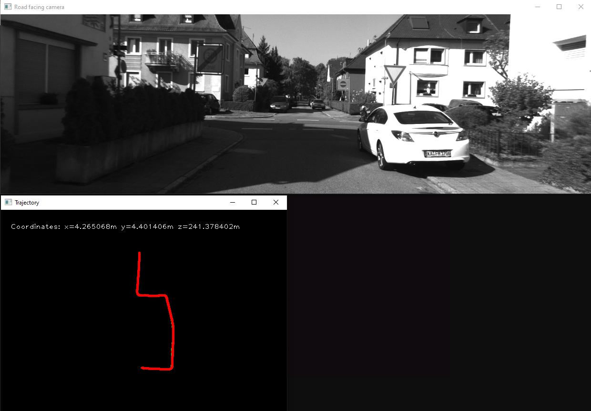

# Visual Odometry

This repo contains the process of developing multiple Visual Odometry scripts and algorithms in order to determine location and movement by using pictures from the KITTI odometry dataset. 

This odometry system is still a work in progress, but certain scripts are already functional and provide a nice sample of current functionality. For instance, running the test.py function will give a nice demonstration of camera based location tracking.

### Dataset

The required data for running the functions can be found at the following handles. The relative paths in the code need to be adjusted based on where these datasets are located on your system. 

[KITTI odometry data set (grayscale, 22 GB)](http://www.cvlibs.net/datasets/kitti/eval_odometry.php)

[calibration data](http://www.cvlibs.net/download.php?file=data_odometry_calib.zip)
#### Requirements

Python Library Requirements can be found in requirements.txt

#### Preview
An demonstration of a short odometry-determined route is shown below:

